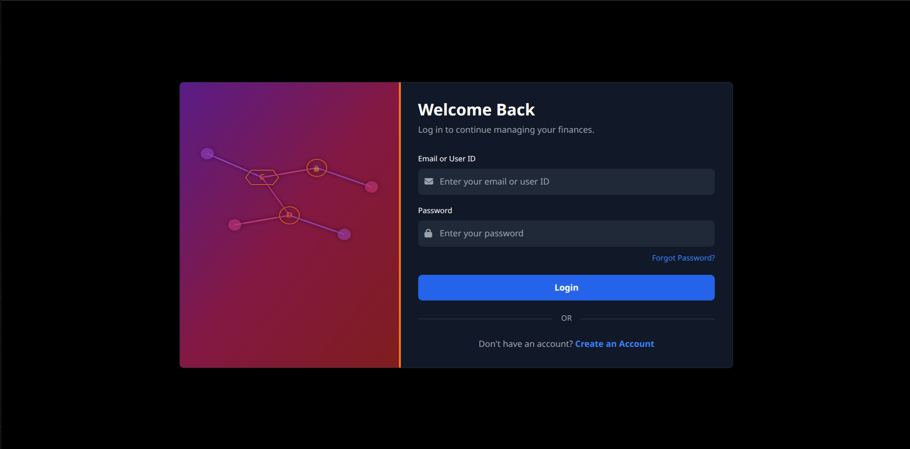
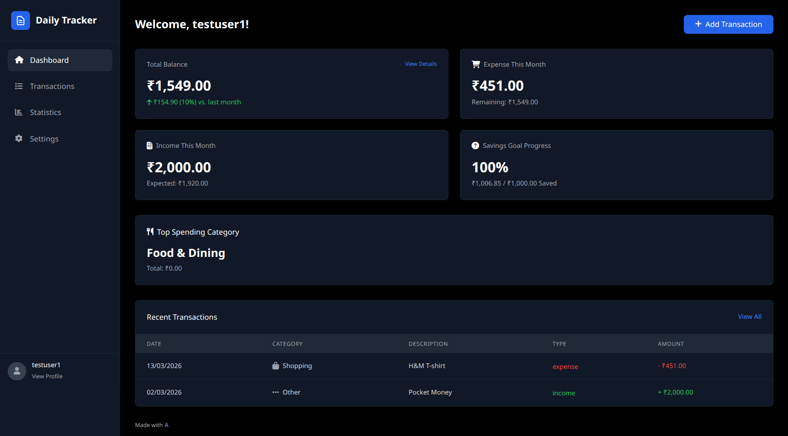
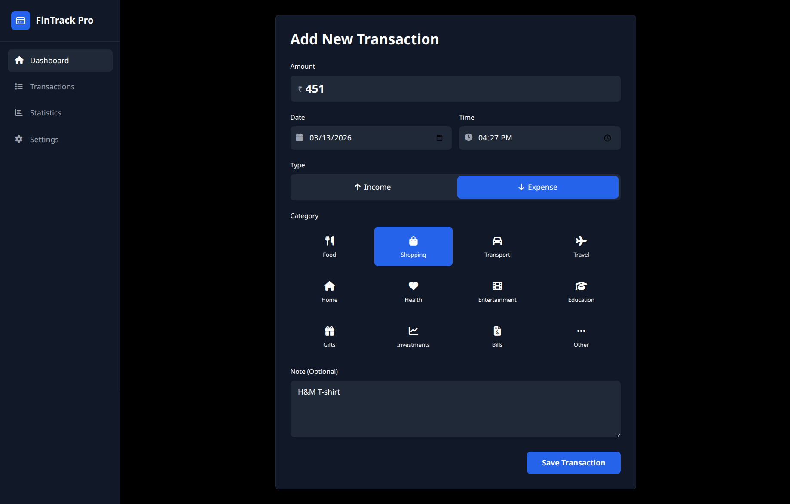
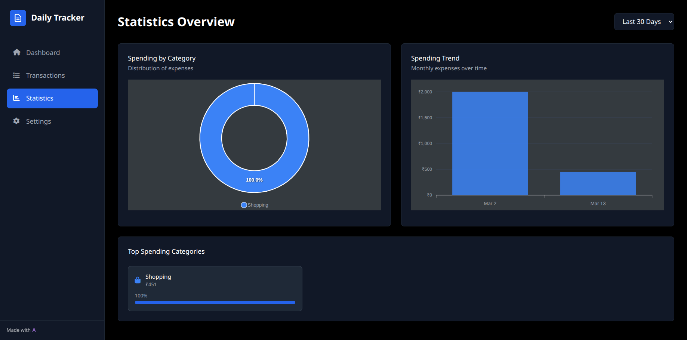
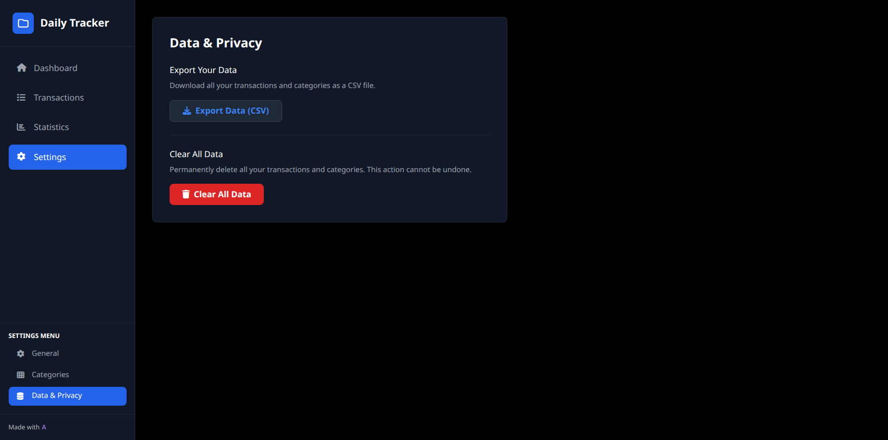

# 🪙 **Transaction Tracking Web Application**

A full-stack expense management system built using **FastAPI**, **MongoDB**, **HTML/TailwindCSS**, **Vanilla JavaScript**, and deployed on **HuggingFace Spaces (Docker)**.

---

## 📌 **Overview**

This project is a simple but complete personal **transaction tracking system** that supports:

- ✔ User Authentication (Signup + Login)
- ✔ Add Income/Expense Transactions
- ✔ Dashboard with Balance Summary
- ✔ View Transaction History (Grouped + Filters)
- ✔ Statistics (Pie Chart + Bar Chart)
- ✔ Category Management
- ✔ Settings (Theme, Currency, Categories)
- ✔ Fully Responsive UI (Desktop + Mobile)
- ✔ MongoDB Atlas Integration
- ✔ Deployed using Docker on HuggingFace Spaces

---

## 🚀 **Live Demo**

🔗 **Frontend + Backend (HuggingFace Space):**

```
https://abhijitpadhi1-transaction-tracking.hf.space/
```

---

## 🏗 **Tech Stack**

### **Frontend**

- HTML5
- TailwindCSS
- Vanilla JavaScript
- ApexCharts (Pie & Bar charts)

### **Backend**

- FastAPI (Python)
- Uvicorn
- PyMongo (MongoDB driver)
- JWT Authentication (python-jose)
- Passlib (password hashing)

### **Database**

- MongoDB Atlas (Free Tier Cluster)

### **Deployment**

- Docker
- HuggingFace Spaces

---

# 🧱 **Project Structure**

```
transaction-tracker/
│
├── backend/
│   ├── main.py
│   ├── db.py
│   ├── routers/
│   │   ├── auth.py
│   │   ├── transactions.py
│   │   ├── categories.py
│   │   └── analytics.py
│   └── utils/
│       ├── jwt_handler.py
│       └── password.py
│
├── frontend/
│   ├── index.html
│   ├── signup.html
│   ├── login.html
│   ├── dashboard.html
│   ├── add-transaction.html
│   ├── history.html
│   ├── statistics.html
│   ├── settings.html
│   └── assets/
│       ├── css/
|       |   └── style.css
│       ├── js/
|       |   ├── add.js
|       |   ├── api.js
|       |   ├── auth.js
|       |   ├── dashboard.js
|       |   ├── history.js
|       |   ├── settings.js
|       |   └── stats.js
│       └── images/
|           └── favicon.svg
│
├── Dockerfile
├── start.sh
├── .python-version
├── .gitignore
├── pyproject.toml
├── uv.lock
└── README.md
```

---

# 🔐 **Authentication Flow**

The app uses **JWT tokens** for authentication.

1. User signs up
2. Logs in using username & password
3. Server returns a JWT token
4. Token is stored in `localStorage`
5. All protected routes require `Authorization: Bearer <token>`
6. Token is validated and decoded using `python-jose`

---

# 📊 **Features & Screens**

### 1️⃣ Authentication

- User Signup
- User Login
- Token-based authentication

### 2️⃣ Dashboard

- Total Balance
- Income / Expense Summary
- Recent Transactions

### 3️⃣ Add Transaction

- Amount
- Type: Income or Expense
- Category
- Date & Time
- Notes

### 4️⃣ Transaction History

- Search
- Daily / Weekly / Monthly Filters
- Grouped by Date (Today, Yesterday, etc.)

### 5️⃣ Statistics

- Pie chart → category-wise spending
- Bar chart → daily or monthly spending
- Top expense categories

### 6️⃣ Settings

- Manage categories
- Currency selector
- Dark/Light theme toggle
- Clear data

---

# 🗄️ **Database Collections**

MongoDB database: `TransactionTracking`

#### **1. users**

```
{
  _id: UUID,
  username: string,
  email: string,
  password_hash: string,
  preferred_currency: string
}
```

#### **2. transactions**

```
{
  _id: UUID,
  user_id: UUID,
  amount: number,
  type: "income" | "expense",
  category: string,
  note: string,
  date: ISODate
}
```

#### **3. categories**

```
{
  _id: UUID,
  user_id: UUID,
  name: string,
  icon: string,
  type: "income" | "expense"
}
```

---

# 🚀 **Local Development Setup**

### 1️⃣ Clone the repository

```bash
git clone https://github.com/abhijitpadhi1/Transaction-Tracking.git
cd transaction-tracker
```

### 2️⃣ Create a virtual environment

```bash
python -m venv venv
source venv/bin/activate   # Linux/Mac
venv\Scripts\activate      # Windows
```

### 3️⃣ Install dependencies

```bash
pip install -r requirements.txt
```

### 4️⃣ Create `.env` file

```
SECRET_KEY=<your_local_secret_key>
MONGODB_URI=<your_mongodb_uri_here>
ACCESS_TOKEN_EXPIRE_MINUTES=1440
```

### 5️⃣ Run FastAPI backend

```bash
uvicorn backend.main:app --reload
```

Backend will run at:

```
http://127.0.0.1:7680
```

### 6️⃣ Open frontend

Simply open any `.html` file in browser (or serve via any static server).

---

# 🐳 **Docker Deployment (HuggingFace Spaces)**

### Build command (HF Space does this automatically)

```
docker build -t transaction-tracker .
```

### Run container

```
docker run -p 7860:7860 transaction-tracker
```

---

# 🌐 **Environment Variables for Production**

Set these in HuggingFace **Secrets**:

```
SECRET_KEY=your_secret_key
MONGODB_URI=your_cluster_uri
```

Set these in HuggingFace **Variables**:

```
ACCESS_TOKEN_EXPIRE_MINUTES=1440
HOST=0.0.0.0
PORT=7860
```

---

# 📡 **API Endpoints (Summary)**

### **Auth**

- `POST /auth/signup`
- `POST /auth/login`

### **Transactions**

- `POST /transactions/add`
- `GET /transactions/recent`
- `GET /transactions/history`
- `GET /transactions/filter?type=daily|weekly|monthly`
- `PUT /transactions/update/{id}`
- `DELETE /transactions/delete/{id}`

### **Categories**

- `GET /categories/list`
- `POST /categories/add`
- `DELETE /categories/delete/{id}`

### **Analytics**

- `GET /analytics/pie`
- `GET /analytics/bar?days=7`
- `GET /analytics/top-categories`
- `GET /analytics/monthly-summary`

---

# 🎯 **Screenshots**

### Landing Page


### Login Page


### Signup Page


### Dashboard


### Addition of Transactions


### Statistics


### Settings


---

# 🙌 **Contributing**

Pull requests are welcome!
Please follow the steps:

1. Fork repository
2. Create feature branch
3. Commit changes
4. Create PR

---

# 📄 **License**

MIT License.
You are free to use, modify, and distribute this project.

---

# 🎉 **Credits**

Developed by **Abhijit Padhi**

---

# 🚀 **Need Help?**

Open an issue on GitHub.
